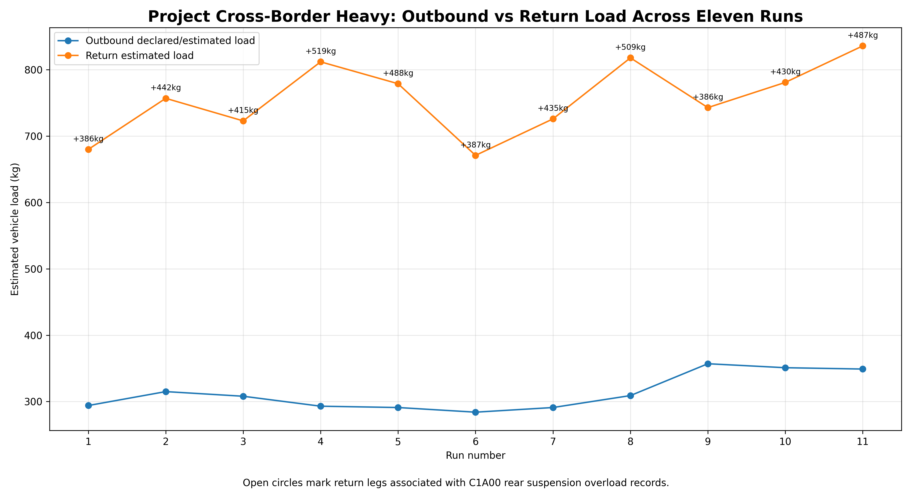
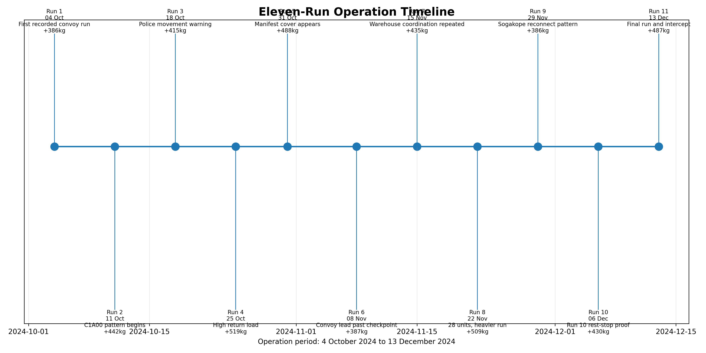
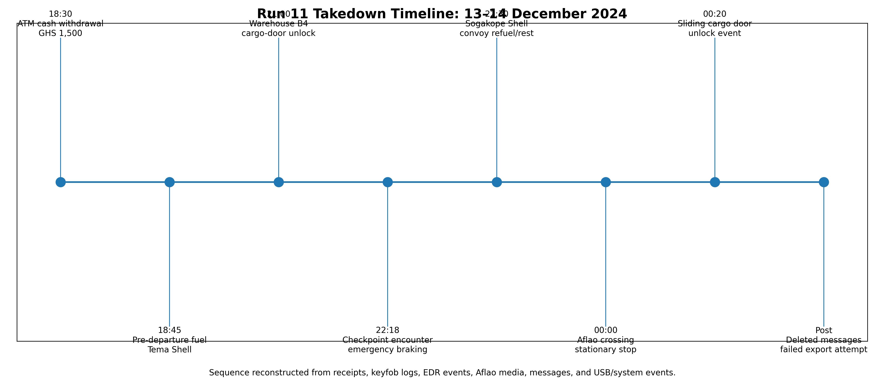
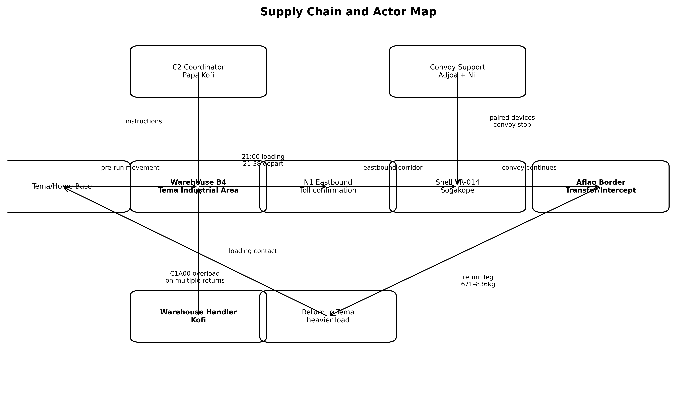
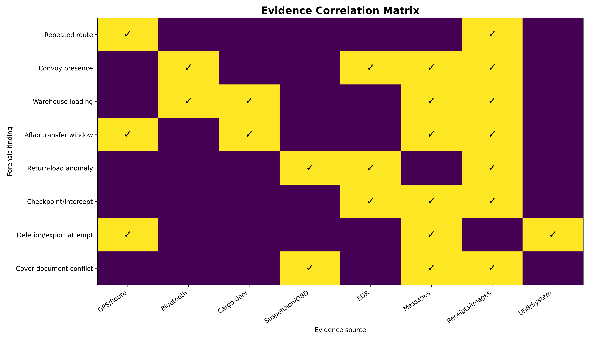

# Project Cross-Border Heavy: Vehicle Digital Forensics Case Study

## Overview

This repository presents a vehicle digital forensics case study reconstructed from an E01 forensic image analyzed with Autopsy. The case demonstrates how modern vehicle artifacts can be correlated to reconstruct route activity, convoy behavior, cargo-door events, load anomalies, deleted communications, and post-event deletion attempts.

The case centers on an eleven-run operation along the Tema to Sogakope to Aflao corridor. On paper, the vehicle appeared to support textile transportation. However, internal vehicle data showed a repeated return-leg load anomaly that contradicted the declared cargo narrative.

> Public release note: identifiers, exact coordinates, account details, phone numbers, vehicle registrations, and other sensitive fields are ficional.

## Case Identity

| Field | Description |
|---|---|
| Case title | Project Cross-Border Heavy |
| Case type | Vehicle digital forensics / cargo discrepancy reconstruction |
| Source image | E01 forensic image |
| Analysis platform | Autopsy |
| Primary vehicle | Toyota HiAce, anonymized as `VEHICLE_01` |
| Route corridor | Tema Industrial Area to Sogakope to Aflao Border Crossing to Tema |
| Operation period | 4 October 2024 to 14 December 2024 |
| Total reconstructed runs | 11 |

## Core Forensic Question

Was the vehicle engaged in ordinary textile transport, or did its internal records reveal a coordinated cross-border cargo movement pattern?

The reconstruction focused on whether independent vehicle artifacts supported the same operational story across eleven runs.

## Evidence Sources

The analysis used artifacts extracted from the E01 image through Autopsy, including:

- GPS track logs
- Raw NMEA/location data
- Route history records
- Destination records
- Bluetooth paired-device logs
- Keyfob and cargo-door events
- Suspension load logs
- OBD snapshot records
- Diagnostic trouble code logs
- EDR/emergency event records
- Deleted and recovered messages
- Call logs and contacts
- POI/search history
- USB/system events
- Media files, dashcam frames, receipts, and CCTV-style images

## Repository Structure

```text
project-cross-border-heavy/
|
├── README.md
├── methodology.md
├── case-summary.md
├── forensic-timeline.md
├── evidence-matrix.md
├── findings-report.md
|
├── data_sanitized/
│   ├── gps_track_sanitized.csv
│   ├── route_history_sanitized.csv
│   ├── paired_devices_sanitized.csv
│   ├── keyfob_log_sanitized.csv
│   ├── suspension_log_sanitized.csv
│   ├── edr_events_sanitized.csv
│   ├── messages_sanitized.csv
│   └── usb_events_sanitized.csv
|
├── exhibits_redacted/
│   ├── warehouse_b4_loading_redacted.jpg
│   ├── sogakope_convoy_cctv_redacted.jpg
│   ├── aflao_crossing_run11_redacted.jpg
│   ├── manifest_cover_run01_redacted.jpg
│   ├── shell_sogakope_run11_redacted.jpg
│   ├── shell_tema_predeparture_run11_redacted.jpg
│   ├── checkpoint_run11_redacted.jpg
│   └── n1_toll_run01_redacted.jpg
|
└── visuals/
    ├── load_discrepancy_chart.png
    ├── eleven_run_timeline.png
    ├── run11_takedown_timeline.png
    ├── supply_chain_map.png
    ├── evidence_correlation_matrix.png
    ├── route_map.png
    └── convoy_correlation_chart.png
```

## Key Findings

The evidence supports a repeated eleven-run operational pattern.

| Finding | Summary |
|---|---|
| Route repetition | The same Tema to Sogakope to Aflao route appeared across the reconstructed runs. |
| Convoy correlation | The same paired devices and support vehicles appeared repeatedly during the runs. |
| Warehouse staging | Cargo-door events and visual evidence placed the vehicle at Warehouse B4 before outbound movement. |
| Sogakope coordination | Receipts, GPS timing, and convoy evidence supported repeated rest/refuel stops at Sogakope. |
| Aflao transfer window | GPS, cargo-door events, and recovered images supported a repeated border-side stop pattern. |
| Return-load anomaly | Return-leg suspension readings were consistently much higher than outbound readings. |
| Mechanical footprint | C1A00 suspension overload records supported the heavy-return pattern. |
| OPSEC collapse | Deleted messages and USB/system events showed attempted concealment after the final run. |

## Load Discrepancy Summary

The strongest technical anomaly came from the suspension and OBD evidence.

| Metric | Finding |
|---|---|
| Outbound load range | 284 to 357 kg |
| Return load range | 671 to 836 kg |
| Estimated added return load across 11 runs | Approximately 4,884 kg |
| Repeated diagnostic fault | C1A00 rear suspension overload |

The outbound loads were broadly consistent with the declared textile cover. The return loads were not.

## Visual Summary

### Load Discrepancy Across Eleven Runs



### Eleven-Run Timeline



### Run 11 Takedown Timeline



### Supply Chain and Actor Map



### Evidence Correlation Matrix



## Run 11 Summary

Run 11 followed the same pattern as earlier runs but ended with an interception sequence.

| Time | Event |
|---|---|
| 18:30 | Cash withdrawal before departure |
| 18:45 | Pre-departure fuel stop in Tema |
| Around 21:00 | Warehouse B4 loading pattern |
| 22:18 | Checkpoint/emergency braking event |
| 22:30 | Sogakope convoy refuel/rest stop |
| 00:00 | Aflao crossing stop |
| 00:20 | Cargo sliding door unlock event |
| Post-event | Deleted messages and failed export/deletion attempt |

## Forensic Interpretation

The paper trail suggested textile movement. The vehicle telemetry suggested something else.

The strongest conclusion comes from the convergence of multiple independent artifacts: GPS routes, Bluetooth pairings, cargo-door events, suspension logs, EDR activity, deleted messages, visual evidence, receipts, and diagnostic records.

The data does not rely on one artifact alone. Each source supports part of the reconstruction, and the combined pattern shows a structured eleven-run operation with staging, convoy support, border-side activity, heavier return loads, and concealment behavior.

## Key Lesson

Modern vehicles are digital witnesses.

They can preserve evidence of:

- where the vehicle travelled,
- which devices connected,
- when doors opened,
- how much load the vehicle carried,
- how the vehicle behaved mechanically,
- when abnormal braking occurred,
- and whether users attempted to delete or export data.

When correlated properly, these artifacts can reconstruct a full operational timeline.

## Disclaimer

This repository is shared for digital forensic education and portfolio demonstration. The analysis is based on artifacts extracted from an E01 forensic image using Autopsy. Sensitive identifiers, personal information, exact coordinates, financial details, vehicle registrations, and operationally sensitive data should be anonymized or redacted before publication.

The original E01 forensic image is not included in this repository.
